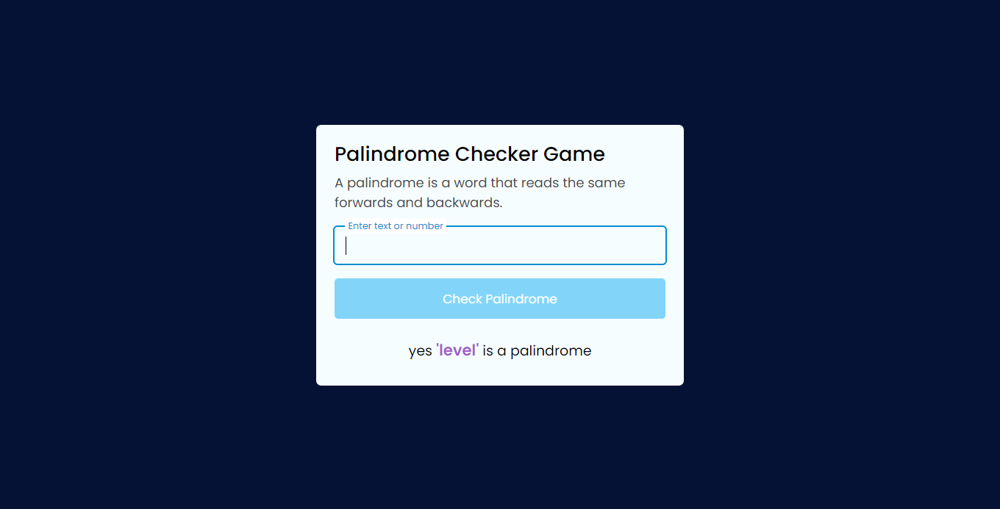
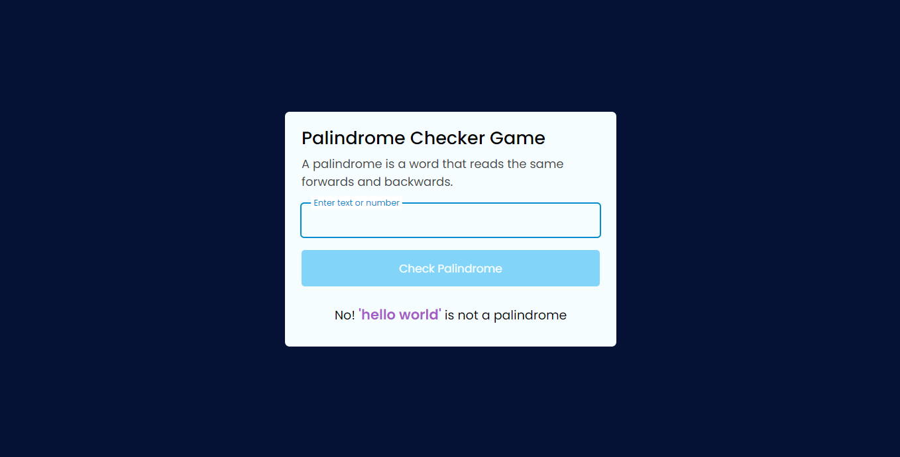

## Over view

[Check out](https://palindromegame.netlify.app/)

### A palindrome is a word, number, phrase, or other sequence of symbols that reads the same backwards as forwards, such as the words madam or racecar,
